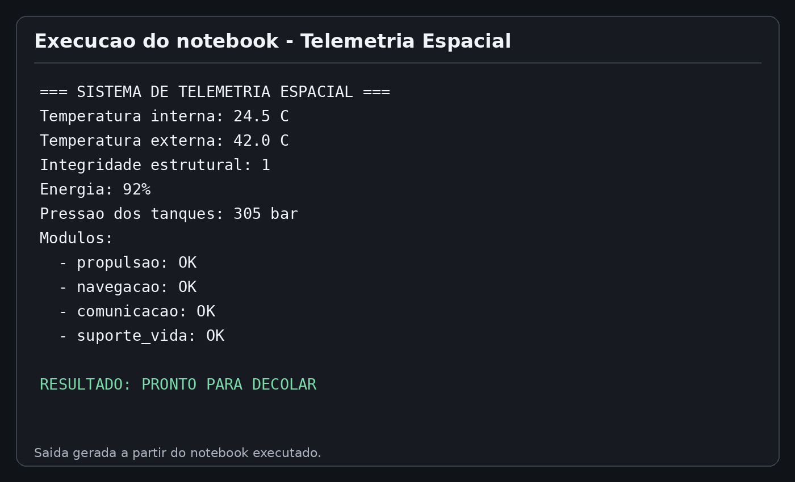

# Sistema de Telemetria Espacial

Projeto acadêmico que simula a verificação de parâmetros de uma missão espacial antes da decolagem.

## O que o projeto verifica

- Temperatura interna e externa;
- Integridade estrutural;
- Nível de energia;
- Pressão dos tanques;
- Status dos módulos críticos;
- Análise energética;
- Análise assistida por IA.

> As faixas de segurança utilizadas são fictícias e servem apenas para fins acadêmicos.

## Como executar

1. Tenha Python 3 e Jupyter Notebook instalados.
2. Abra o arquivo `telemetria_espacial.ipynb`.
3. Execute todas as células em ordem.
4. O notebook exibirá `PRONTO PARA DECOLAR` ou `DECOLAGEM ABORTADA`.

## Exemplo de execução

## Entrega

A entrega é composta por:

- `relatorio_telemetria_espacial.pdf`;
- este repositório público no GitHub contendo o notebook e este README.
